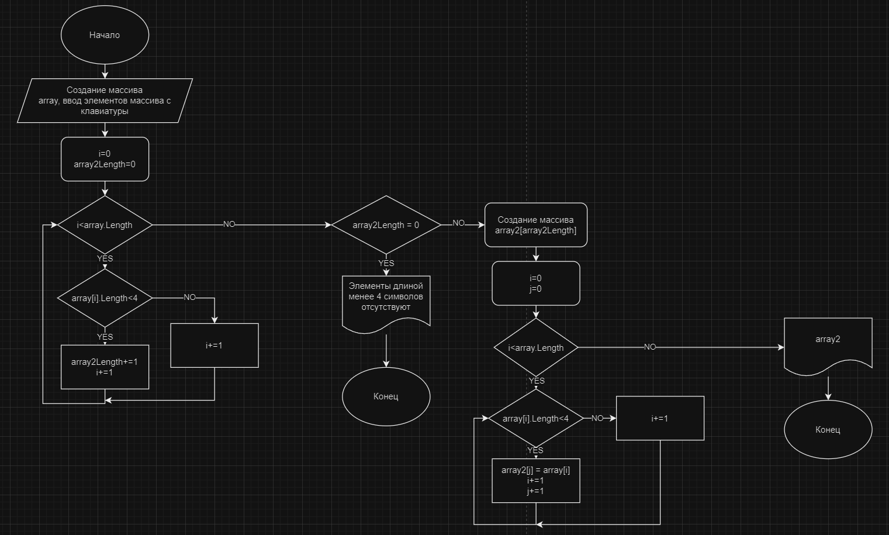

1) Создаем метод GenerateArray, позволяющий задать массив посредством ввода с клавиатуры.
2) Создаем метод FilterThreeSymbolElements, который отбирает элементы длиной менее 4 символов и создает из них новый массив. Поскольку мы не можем создать массив с изменяемой длиной, проходимся по первоначальному массиву дважды: в первый раз, чтобы узнать длину массива array2, во второй для его заполнения. Также добавляем в метод проверку на случай, когда нет элементов, удовлетворяющих нашим требованиям.
3) Блок-схема программы:
